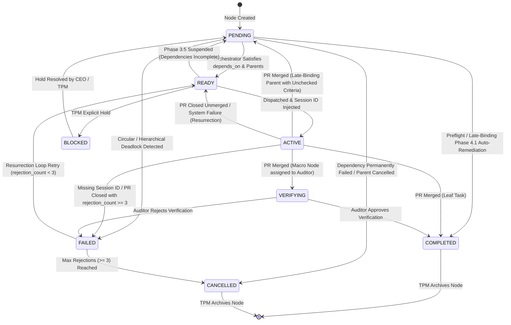
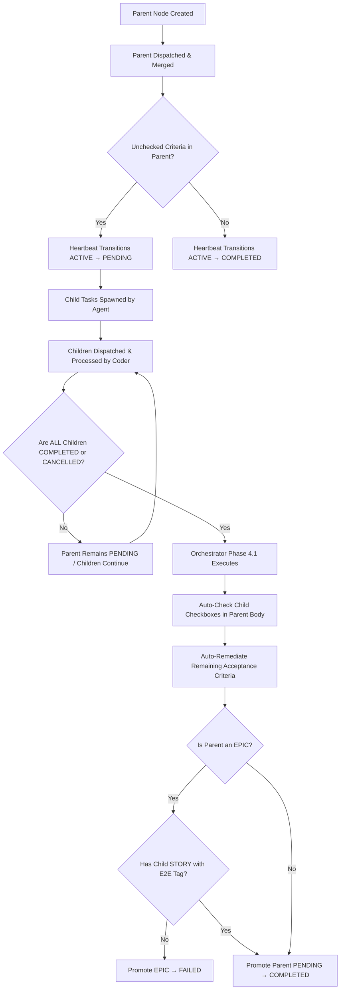

# The Foundry Orchestrator — Lifecycle, Audit & Sequence Specification

> **Authority:** Comprehensive Audit & System Specification for The Foundry Engine, DAG Orchestrator (`foundry-orchestrator.ts`), and Heartbeat Monitor (`foundry-heartbeat.ts`).

---

## 1. Executive Summary & Audit Findings

An in-depth audit of the Foundry DAG Orchestrator and Heartbeat system confirms that the core architectural logic is **sound, resilient, and fully intact**.

* **Late-Binding Integrity**: Late-binding mechanisms (keeping parent nodes in `PENDING` wait states while child tasks execute, auto-checking checkboxes upon child completion, and auto-remediating parent nodes in Phase 4.1) are fully functional and covered by dedicated test suites.
* **Heartbeat Robustness**: Multi-layered PR discovery (Jules API → GitHub Search → GitHub List Scan) prevents false-positive zombie failures due to search index delays. Unmerged PRs correctly trigger resurrection (`rejection_count` increment) up to the max threshold (3), after which nodes transition to `FAILED` / `CANCELLED`.
* **Cycle & Deadlock Prevention**: Both flat dependency cycles (Phase 3.9) and parent-child hierarchical deadlocks (Phase 3.10) are detected via Depth-First Search (DFS) traversal before node promotion.
* **Idempotency & Preflight**: Preflight checks bypass session dispatch when target artifacts already exist and are completed, preventing redundant API cost and execution loops.
* **Critical Path Weighting**: Ready nodes are prioritized based on downstream reachability weight (number of unblocked nodes), ensuring high-impact tasks are dispatched first.

---

## 2. End-to-End Engine Sequence Diagram

The following sequence diagram illustrates the complete execution flow from workflow trigger to agent session dispatch, PR merge, and late-binding auto-completion.

```mermaid
sequenceDiagram
    autonumber
    actor Trigger as GitHub Actions (Hourly / Dispatch)
    participant Engine as foundry-engine.yml
    participant Heartbeat as foundry-heartbeat.ts
    participant Orchestrator as foundry-orchestrator.ts
    participant Matrix as Actions Job Matrix
    participant JulesAPI as Jules API
    participant ActiveScript as foundry-active.ts
    participant Agent as Jules Agent / PR
    participant Auditor as Auditor Persona

    Trigger->>Engine: Run Engine Workflow
    Engine->>Heartbeat: Execute Heartbeat Scan

    rect rgb(240, 248, 255)
        note over Heartbeat: Pass 1: Monitor ACTIVE Nodes
        Heartbeat->>JulesAPI: Fetch session state / PR URL
        alt PR Merged (Leaf Task)
            Heartbeat->>Heartbeat: Transition ACTIVE → COMPLETED
        else PR Merged (Parent Node with unchecked tasks)
            Heartbeat->>Heartbeat: Transition ACTIVE → PENDING (Late-Binding Wait)
        else PR Merged (Macro Node: IDEA/PRD/EPIC)
            Heartbeat->>Heartbeat: Transition ACTIVE → VERIFYING (owner: auditor)
        else PR Closed (Unmerged)
            Heartbeat->>Heartbeat: Increment rejection_count; ACTIVE → READY (or FAILED if >= 3)
        else Session Terminal without PR
            Heartbeat->>Heartbeat: System failure → ACTIVE → READY (No penalty)
        end
        note over Heartbeat: Pass 2: Retry FAILED Nodes (rejection_count < 3)
        note over Heartbeat: Pass 3: Cleanup Remote Branches
    end

    Engine->>Orchestrator: Execute Orchestrator (--strict)

    rect rgb(255, 250, 240)
        note over Orchestrator: Phases 1–3: Discover, Parse, Build Maps
        note over Orchestrator: Phase 3.1: Cascade Cancellations
        note over Orchestrator: Phase 3.5: Suspend ACTIVE/READY if children incomplete
        note over Orchestrator: Phase 3.6: Impossible Loop (Wake parent / flag TPM)
        note over Orchestrator: Phase 3.9 & 3.10: Circular & Hierarchical Cycle Detection
        note over Orchestrator: Phase 4: Resolve eligible PENDING nodes
        note over Orchestrator: Phase 4.1: Late-Binding Completion & Auto-Remediation
        note over Orchestrator: Phase 4.5: Idempotent Generation & Preflight Check
        note over Orchestrator: Phase 4.8: Persona Mapping Validation
        note over Orchestrator: Phase 5 & 6: Promote to READY & Collect (Critical Weight Sort)
    end

    Orchestrator-->>Engine: Output JSON Matrix (stdout)

    alt Matrix is Not Empty
        loop For Each READY Node in Matrix
            Engine->>Matrix: Spawn Parallel Execution Job
            Matrix->>Orchestrator: Compile Layered Prompt (--compile)
            Matrix->>JulesAPI: POST /v1alpha/sessions (Spawn Agent)
            JulesAPI-->>Matrix: Return jules_session_id
            Matrix->>ActiveScript: Execute transition (READY → ACTIVE)
            ActiveScript->>ActiveScript: Strict Dumb Diff Validation & Save
            Matrix->>Engine: Commit State Change to main

            Agent->>Agent: Implement Changes & Create PR

            opt Macro Node Merged
                Auditor->>Auditor: Verify Artifacts
                Auditor->>Heartbeat: Transition VERIFYING → COMPLETED
            end
        end
    end
```

---

## 3. Node Lifecycle State Machine



---

## 4. Late-Binding Lifecycle Flowchart

The flowchart below details how a parent node remains in a `PENDING` wait state while child tasks execute, and how Phase 4.1 auto-completes the parent once all child nodes reach terminal states.



---

## 5. Phase-by-Phase Orchestrator Analysis

| Phase | Name | Operations & Logic |
|---|---|---|
| **1** | **DISCOVER** | Recursively walks `.foundry/`. Skips `journals/`, `fixtures/`, `archive/`, and non-ADR docs. |
| **2** | **PARSE** | Extracts YAML frontmatter with `gray-matter`. Validates schema via Zod (`NodeFrontmatterSchema`). Skips malformed files with warnings. |
| **3** | **MAP** | Builds `nodeMap` (repoPath → Node) and `idToPathMap` (ID → repoPath). Resolves parent-child links via explicit frontmatter `parent`, markdown links `](.foundry/...)`, and raw ID matches. |
| **3.0** | **MAX REJECTIONS** | Auto-promotes `FAILED` nodes with `rejection_count >= 3` to `CANCELLED`. |
| **3.1** | **CASCADE CANCEL** | Recursively cascades `CANCELLED` status down to non-completed child nodes. |
| **3.5** | **SUSPEND** | Suspends `ACTIVE`, `VERIFYING`, or `READY` nodes to `PENDING` if any child or dependency is incomplete. |
| **3.6** | **IMPOSSIBLE LOOP** | Identifies unacknowledged child failures. Wakes up the parent node to `READY` or `ACTIVE` (for human) with feeedback, or flags for `tpm` if orphan. |
| **3.9** | **CYCLE DETECT** | Performs DFS cycle detection across `PENDING` nodes. Marks cycle participants as `FAILED`. |
| **3.10** | **DEADLOCK DETECT**| Detects hierarchical parent-child cycles. Marks offending nodes as `FAILED`. |
| **4** | **RESOLVE** | Identifies eligible `PENDING` nodes with satisfied dependencies. Waives parent block for late-binding children. Performs preflight checks for existing completed artifacts. |
| **4.1** | **LATE-BINDING** | Evaluates `PENDING` parents with all completed/cancelled children. Auto-checks checkboxes, auto-remediates remaining criteria, verifies E2E story for EPICs, and promotes to `COMPLETED`. |
| **4.5** | **IDEMPOTENT** | Bypasses session dispatch for generation nodes if child artifacts already exist on disk. |
| **4.8** | **MAPPING VALIDATE**| Enforces node type to owner persona constraints (e.g. `TASK` → `coder`/`qa`/`tech_lead`/`architect`). |
| **5 & 5.1**| **PROMOTE** | Promotes eligible nodes `PENDING` → `READY` (or `ACTIVE` for `owner_persona: human`). Upgrades existing `READY` human tasks to `ACTIVE`. |
| **6** | **COLLECT** | Gathers `READY` and `VERIFYING` nodes. Calculates Critical Path Weights based on reverse dependency depth. Sorts by weight (descending) and creation date (ascending). |
| **7 & 8**| **OUTPUT & EXIT** | Outputs JSON matrix to stdout (only stdout output). Exits with code 0 (or 1 in `--strict` mode if warnings occurred). |

---

## 6. Heartbeat Subsystem Analysis

* **Execution Timing**: Runs as step 1 in `foundry-engine.yml` before reference verification and orchestration.
* **Resurrection Policy**:
  * Unmerged PR close / rejection → `rejection_count` incremented by 1.
  * `rejection_count < 3` → Node resurrected `FAILED` → `READY`.
  * `rejection_count >= 3` → Node marked `FAILED` ("Max rejection count reached"), triggering cascade cancellation of dependent `PENDING` nodes.
* **System Failure Policy**: Sessions terminating without PR due to network/API error transition to `READY` **without penalty** (rejection_count is NOT incremented).
* **Remote Branch Cleanup**: `cleanupRemoteBranches()` identifies branches belonging to `FAILED` or `CANCELLED` sessions that have no active PRs, deleting them via GitHub Git Data API.

---

## 7. Audit Conclusion & Verification Summary

All 203 unit and integration tests across `.github/scripts/` pass cleanly. The Foundry Orchestrator logic is verified to be sound, safe, idempotent, and dead-lock free.
