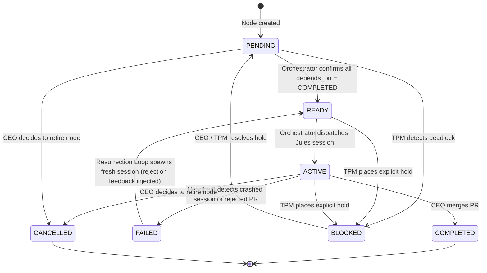

# The Foundry — Master Schema & System Rules

> **Authority:** This document is the single source of truth for all Foundry agents and automation scripts.
> **Owner:** `tech_lead` — any structural change to this document requires a PR authored by the Tech Lead persona.
> **Last Updated:** 2026-04-20

---

## 1. System Overview

The Foundry is an autonomous software factory layered on this repository. The **repository itself is the database**: every concept in the product lifecycle — from a raw CEO thought through to a shipped task — lives as a markdown file with YAML frontmatter under the `.foundry/` directory at the repository root.

The workflow is a directed acyclic graph (DAG):

```
IDEA → PRD → EPIC → STORY → TASK
```

A custom orchestrator (`.github/scripts/foundry-orchestrator.ts`) parses the `depends_on` field across all files to find nodes with an **in-degree of zero** (all dependencies satisfied). These unblocked nodes are dispatched in parallel to Jules agent sessions via a GitHub Actions matrix. All PR transitions require explicit **CEO approval** — automerge is disabled.

---

## 2. Directory Conventions

| Directory | Node Type | Owning Persona | Description |
|---|---|---|---|
| `.foundry/ideas/` | `IDEA` | `product_manager` | Raw CEO thoughts, intake queue. |
| `.foundry/prds/` | `PRD` | `product_manager` | Structured Product Requirements Documents. |
| `.foundry/epics/` | `EPIC` | `epic_planner` | Macroscopic functional chunks derived from PRDs. |
| `.foundry/stories/` | `STORY` | `story_owner` | Incremental, sequentially-planned delivery steps. Stories are late-binding: Story N+1 is only written after Story N completes so lessons are incorporated. |
| `.foundry/tasks/` | `TASK` | `coder` | Concrete engineering blueprints. The Tech Lead writes them; the Coder implements; QA validates. |
| `.foundry/journals/` | — | `tpm` | Persistent agent learning logs. Each persona decides its own structure (single file, subdirectory, multiple files by domain, etc.). The `tpm` is responsible for archiving stale journal content. |
| `.foundry/docs/adrs/` | ADR | `tech_lead` | Architecture Decision Records. The Tech Lead reads these before writing any Task to ensure consistency. |
| `.foundry/docs/style_guides/` | Style Guide | `designer` | Global UX/UI constraints injected into designer tasks. |

### File Naming Convention

Files are named after their `id` field:

```
<type>-<parent_NNN>-<NNN>-<slug>.md
```
*(Note: `IDEA` nodes do not have a parent and omit the `<parent_NNN>` segment.)*

Examples:
- `.foundry/ideas/idea-001-auth-overhaul.md` (Idea, no parent)
- `.foundry/prds/prd-001-002-auth-spec.md` (PRD spawned from Idea 001)
- `.foundry/tasks/task-010-042-parse-daycare-offsets.md` (Task spawned from Story 010)

- `<type>` is lowercase (idea, prd, epic, story, task).
- `<parent_NNN>` is the zero-padded three-digit sequence number of the parent node (use `000` if a non-IDEA node is orphaned).
- `<NNN>` is a zero-padded three-digit sequence number. This number must be uniquely incremented on a best-effort basis globally per node directory (e.g., all tasks share the same increment pool), not reset per parent.
- `<slug>` is a short, kebab-case descriptor.

---

## 3. YAML Frontmatter Schema

Every node file (idea, PRD, epic, story, task) **must** begin with a YAML frontmatter block. Fields marked **Required** will cause the orchestrator to skip or error on the node if absent.

```yaml
---
id: ""                  # Required. Globally unique slug. Convention: <type>-<parent_NNN>-<NNN>-<slug>
type: ""                # Required. Enum: IDEA | PRD | EPIC | STORY | TASK
title: ""               # Required. Human-readable short title.
status: ""              # Required. Enum: see Status Lifecycle section.
owner_persona: "coder"  # Required. Enum: see Owner Persona section.
created_at: ""          # Required. ISO-8601 date (YYYY-MM-DD). Set once, never edited.
updated_at: ""          # Required. ISO-8601 date. Updated by any persona that edits the node.
depends_on: []          # Required. Array of repo-relative file paths. Empty [] = unblocked.
jules_session_id: null  # Required. Active Jules session ID string, or null when idle.
pr_number: null         # Optional. PR number for human-in-the-loop tasks, or null.
parent: null            # Required if node is derived from another node (e.g. PRD from IDEA, EPIC from PRD). Repo-relative path to the logical parent node. Blocks the parent from completion if this node is incomplete.
tags: []                # Optional. Free-form string labels for filtering and context injection.
research_references: [] # Optional. Array of repo-relative paths to research nodes.
rejection_count: 0      # Optional. Incremented by the Resurrection Loop on each CEO veto. Omit for IDEA nodes.
rejection_reason: ""    # Optional. Used when transitioning a node to FAILED because it is fundamentally impossible to complete.
notes: ""               # Optional. Free-form Markdown remarks.
---
```

### 3.1 Field Reference

| Field | Type | Required | Description |
|---|---|---|---|
| `id` | `string` | ✅ | Globally unique. Convention: `<type>-<parent_NNN>-<NNN>-<slug>` (IDEA nodes omit parent NNN). Used by humans and search; the DAG uses file paths. |
| `type` | `enum` | ✅ | `IDEA \| PRD \| EPIC \| STORY \| TASK` |
| `title` | `string` | ✅ | Short, human-readable description. |
| `status` | `enum` | ✅ | Current lifecycle state. See §4. |
| `owner_persona` | `enum` | ✅ | Persona responsible for progressing this node. Must be exactly one assigned persona (no arrays or multiple personas). See §5. |
| `created_at` | `date` | ✅ | ISO-8601 (YYYY-MM-DD). Immutable after creation. |
| `updated_at` | `date` | ✅ | ISO-8601 (YYYY-MM-DD). Must be updated whenever the file is edited. |
| `depends_on` | `string[]` | ✅ | Repo-relative paths to blocking nodes (e.g., `.foundry/stories/story-001-scaffold.md`). **Empty array `[]` means the node has in-degree zero and is eligible for dispatch once all other preconditions are met.** |
| `jules_session_id` | `string \| null` | ✅ | Jules session ID while `ACTIVE`. Always present; `null` when the node is not being processed. Monitored by the heartbeat workflow. |
| `pr_number` | `integer \| null` | optional | PR number for human-in-the-loop tasks, or `null`. |
| `parent` | `string \| null` | optional | Repo-relative path to logical parent (e.g., a story's parent epic). Used for context hydration when spawning Jules — concatenates reading graphs upward. Does **not** affect DAG blocking. |
| `tags` | `string[]` | optional | Labels for filtering and selective context injection (e.g. `["gen2", "save-engine"]`). |
| `research_references` | `string[]` | optional | Array of repo-relative paths to research nodes. |
| `rejection_count` | `integer` | optional | Tracks CEO vetoes. Incremented by the Resurrection Loop. The `agile_coach` monitors high values as signals of chronic failure areas. Omit for `IDEA` and `PRD` nodes. |
| `rejection_reason` | `string` | optional | Used when transitioning a node to `FAILED` because it is fundamentally impossible to complete. |
| `notes` | `string` | optional | Free-form Markdown for human remarks, caveats, or inline research. |

---

## 4. Status Lifecycle

### 4.1 Status Enum

| Status | Description |
|---|---|
| `PENDING` | Node exists but has unresolved `depends_on` entries — not yet eligible for dispatch. |
| `READY` | **Orchestrator-written only.** All `depends_on` nodes are `COMPLETED`. Node is queued for the next dispatch cycle. |
| `ACTIVE` | A Jules session (`jules_session_id`) is currently working on this node. This status persists if a PR is open for review. |
| `COMPLETED` | PR merged. TPM archives the node. |
| `FAILED` | Session crashed silently or PR was rejected/closed without merge. Resurrection Loop re-spawns a fresh session. |
| `BLOCKED` | DAG deadlock or explicit TPM hold. Requires CEO or TPM intervention to resolve. |
| `CANCELLED` | Node retired by CEO decision. Will never be dispatched. |

### 4.2 Valid State Transitions



### 4.3 `READY` Is Orchestrator-Authored — Never Set Manually

No persona should ever manually set `status: READY`. The orchestrator calculates in-degree across the full graph and writes `READY` only when it has confirmed all dependencies are `COMPLETED`. Manual `READY` edits will be overwritten by the next orchestrator run.

---

## 5. Owner Persona Enum

| Value | Role |
|---|---|
| `product_manager` | Transforms `IDEA` → `PRD`. |
| `epic_planner` | Transforms `PRD` → `EPIC` breakdown. |
| `story_owner` | Monitors active epics; writes `STORY` nodes dynamically (late-binding). |
| `architect` | Master of the Blueprint. Maintains ADRs, schemas, and defines global App/Foundry architecture. |
| `tech_lead` | Transforms `STORY` → `TASK` (technical implementation plans). |
| `coder` | Implements individual `TASK` nodes. |
| `qa` | Validates `TASK` implementation against technical contracts. |
| `human` | A human contributor. Bypasses Jules dispatch and heartbeat timeouts. |
| `tpm` | Runs hourly. Archives `COMPLETED` nodes, resolves minor graph deadlocks, manages journals. |
| `agile_coach` | Master of the Process. Evolves persona prompts, monitors learning logs, and optimizes system-wide workflows. |
| `researcher` | Responsible for exploratory tasks and writing context-rich research reports to be used by downstream pipeline nodes. |

---

## 6. Journal Convention

> Journals live under `.foundry/journals/`. Beyond that, **structure is entirely up to each persona.**

A persona may use:
- A single file: `journals/coder.md`
- A subdirectory: `journals/coder/frontend.md` + `journals/coder/backend.md`
- Dated entries, topic-based files, or any other structure that serves their learning needs.

The `tpm` persona is responsible for archiving stale journal content. The only invariant is that journal files **do not use YAML frontmatter** — they are plain Markdown and are not parsed by the orchestrator.

---

## 7. System Invariants

These are the hard rules the orchestrator, heartbeat, and resurrection loop rely on. Violating them produces undefined behaviour.

1. **`created_at` is immutable.** Set it once on node creation. Never edit it.
2. **`updated_at` must be refreshed on every edit.** Any persona that modifies a node must bump this field.
3. **`depends_on` uses repo-relative file paths.** Do not use `id` slugs or short names — the orchestrator resolves paths with `fs.readFile`, not a lookup table.
4. **A node in `ACTIVE` status must have a non-null `jules_session_id`.** If it doesn't, the heartbeat will flip it to `FAILED`.
5. **Only the orchestrator writes `READY`.** Personas must never set this status manually.
6. **Implementers (Coder/QA) must NOT modify node frontmatter**, EXCEPT for the `status` field if they need to mark the task as `FAILED`, and the `rejection_reason` field. They are strictly forbidden from setting the status to `COMPLETED` or `DONE`. They should primarily update the Markdown body.
7. **`COMPLETED` nodes are read-only.** Once a PR is merged, the node must not be edited. The TPM archives it.
8. **`depends_on` paths must be resolvable.** The orchestrator will treat an unresolvable path as a permanent block (equivalent to `BLOCKED`). Always verify paths exist before committing.
9. **Every `.foundry/**/*.md` file that is not a journal or doc must have valid YAML frontmatter.** The orchestrator will skip malformed files and log a warning — they will never be dispatched.
10. **The `id` field must be globally unique across all `.foundry/` directories.** Duplicate IDs are undefined behaviour in the orchestrator.
11. **`owner_persona` must be exactly one persona.** The system enforces a single-owner invariant per node for atomic handoffs; arrays or multiple personas are invalid.
12. **`human` persona bypasses Jules dispatch and heartbeat timeouts.** The orchestrator will not dispatch Jules for nodes owned by `human`, and the heartbeat will not fail them.
13. **Composite Nodes are an anti-pattern.** Do not create "Composite Nodes". They bundle multiple lifecycle states or responsibilities that conflict with the strict Directed Acyclic Graph orchestrator. This leads to circular dependencies or unresolved `depends_on` chains, causing DAG deadlocks.
14. **Sibling Dependency Recommendations.** If multiple sibling nodes (e.g. TASK nodes from the same STORY) are created with sequential implementation dependencies, their `depends_on` field SHOULD explicitly point to the prerequisite task to prevent DAG deadlocks. This is the responsibility of the tech lead and is not enforced by the orchestrator.

---

## 8. New Node Template

Copy-paste this block to start any new node. Fill in all required fields before committing.

```yaml
---
id: <type>-<parent_NNN>-<NNN>-<slug> # e.g. task-001-002-implement-feature
type: 
title: ""
status: PENDING
owner_persona: "coder"
created_at: "YYYY-MM-DD"
updated_at: "YYYY-MM-DD"
depends_on: []
jules_session_id: null
pr_number: null
parent: null
tags: []
research_references: []
rejection_count: 0
rejection_reason: ""
notes: ""
---

# <Title>

<!-- Node body: write your description, acceptance criteria, technical spec, etc. below -->
```

---

## 9. `depends_on` Reference Examples

```yaml
# A story that is blocked by its parent epic being approved:
depends_on:
  - .foundry/epics/epic-001-auth-overhaul.md

# A task blocked by two stories:
depends_on:
  - .foundry/stories/story-002-db-schema.md
  - .foundry/stories/story-003-api-contract.md

# An unblocked node (eligible for dispatch as soon as status = READY):
depends_on: []
```

Paths are **always relative to the repository root**, starting with `.foundry/`.

---

*This document is the bedrock of the Foundry. Before modifying it, open a PR authored by the `tech_lead` persona and obtain CEO approval.*


## 11. EMPTY PR POLICY
If a target artifact already exists and matches the required state, personas must submit an empty PR (0 files changed). The system will automatically merge these PRs to progress the node to `COMPLETED`. Personas should document the reasoning in their journals.
